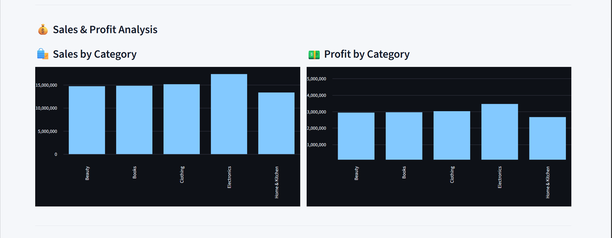

# 📊 AI Anomaly Watcher

AI Anomaly Watcher is an end-to-end **business data monitoring and anomaly detection system** built using Python, Machine Learning, Statistical Analysis, and Streamlit.

The project analyzes **Flipkart e-commerce sales data** and identifies unusual patterns in important business metrics such as:

* Product Price
* Quantity Sold
* Total Sales
* Profit

The system combines **statistical Z-score analysis** with **Machine Learning-based Isolation Forest anomaly detection**. It also generates business-friendly explanations, classifies anomaly severity, maintains alert history, generates reports, and provides an interactive Streamlit dashboard.

---

## 🚀 Project Overview

E-commerce businesses generate large amounts of transaction data. Manually identifying unusual sales, profit, pricing, or quantity patterns can be time-consuming.

AI Anomaly Watcher automates this process by:

* Loading Flipkart e-commerce data
* Cleaning and validating the dataset
* Preparing analytical features
* Performing statistical anomaly detection
* Applying Machine Learning using Isolation Forest
* Calculating Z-scores
* Calculating percentage changes
* Identifying unusual business records
* Generating business-friendly explanations
* Classifying alert severity
* Maintaining alert history
* Generating anomaly reports
* Visualizing business performance through a Streamlit dashboard

---

# 🎯 Problem Statement

E-commerce businesses need an efficient way to identify unusual patterns in their transaction data.

The objective of this project is to build an automated anomaly monitoring system that can:

1. Process e-commerce transaction data.
2. Clean and validate raw business data.
3. Detect statistically unusual records.
4. Detect potential anomalies using Machine Learning.
5. Explain detected anomalies in simple business language.
6. Classify alerts according to severity.
7. Maintain historical alert information.
8. Generate structured reports.
9. Present insights through an interactive dashboard.

---

# 📂 Dataset

The project uses a public **Flipkart E-Commerce Sales Dataset** containing **1,000 transaction records**.

The dataset contains information related to products, sales, customers, discounts, profit, regions, and order dates.

## Main Dataset Columns

| Column             | Description                   |
| ------------------ | ----------------------------- |
| `order_id`         | Unique order identifier       |
| `product_name`     | Name of the purchased product |
| `category`         | Product category              |
| `price_inr`        | Product price in INR          |
| `quantity_sold`    | Quantity sold                 |
| `total_sales_inr`  | Total sales amount            |
| `order_date`       | Date of the order             |
| `payment_method`   | Payment method used           |
| `customer_rating`  | Customer rating               |
| `month`            | Month of the order            |
| `year`             | Year of the order             |
| `profit_inr`       | Profit generated              |
| `discount_percent` | Discount percentage           |
| `customer_segment` | Customer segment              |
| `region`           | Customer region               |

The project also uses calculated analytical fields such as:

* Sales difference
* Profit margin
* Revenue per unit
* Profit per unit
* Month number
* Quarter
* Year-month
* Discount amount
* Net sales after discount

---

# ✨ Key Features

## 1. Data Loading

The system supports business data processing through the project's data-loading pipeline.

The current implementation uses:

```text
data/business_data.csv
```

---

## 2. Data Cleaning & Validation

The data-cleaning module performs:

* Required-column validation
* Duplicate-row detection
* Date conversion
* Numeric data conversion
* Invalid-value checking
* Missing-value validation
* Dataset shape validation
* Data-type inspection

This ensures that the dataset is prepared before anomaly detection begins.

---

# 📊 3. Statistical Anomaly Detection

The project uses the **Z-score statistical method** to identify unusual observations.

The main metrics analyzed are:

* `price_inr`
* `quantity_sold`
* `total_sales_inr`
* `profit_inr`

The configured anomaly threshold is:

```text
Absolute Z-score >= 2.0
```

A record is considered a statistical anomaly when the absolute Z-score reaches or exceeds the configured threshold.

---

# 🤖 4. Machine Learning Anomaly Detection

The project also uses **Isolation Forest**, an unsupervised Machine Learning algorithm available through Scikit-learn.

Isolation Forest is used to identify observations that differ from the general distribution of the dataset.

### ML Features

The model analyzes:

```text
price_inr
quantity_sold
total_sales_inr
profit_inr
```

### Current Configuration

```text
Algorithm: Isolation Forest
Contamination: 0.15
Random State: 42
```

The ML anomaly result is stored as supporting information, while statistical anomalies are used for generating business alerts.

---

# 🧠 5. Business-Friendly Explanations

Detected anomalies are converted into understandable business explanations.

For example, the system can identify situations such as:

* unusually high product price
* unusually high quantity sold
* unusually high sales
* unusually high profit

This makes technical anomaly results easier to understand for business users.

---

# 🚨 6. Alert Severity Classification

Detected statistical anomalies are classified according to their percentage change from the average.

| Percentage Change     | Severity |
| --------------------- | -------- |
| Less than 20%         | Low      |
| 20% to less than 50%  | Medium   |
| 50% to less than 100% | High     |
| 100% or more          | Critical |

This classification helps users quickly understand the magnitude of an unusual business change.

---

# 📝 7. Alert History

The system maintains historical anomaly alerts in:

```text
data/alert_history.csv
```

Alert history can contain information such as:

* Date
* Order ID
* Metric
* Value
* Percentage Change
* Severity
* Product
* Category
* Region
* Z-score
* ML anomaly information
* Monitoring time

The alert management system also normalizes alert-history columns and removes duplicate alerts before saving the updated history.

---

# 📄 8. Generated Reports

The monitoring system generates structured reports.

### `anomaly_report.csv`

Contains the analyzed dataset together with anomaly-related calculations and detection results.

### `alert_report.csv`

Contains the statistical anomaly alerts generated by the system.

### `alert_history.csv`

Stores historical anomaly alerts generated during monitoring.

### `ml_anomaly_report.csv`

Contains Machine Learning anomaly detection information.

---

# 📊 Streamlit Dashboard

The project includes an interactive **Streamlit dashboard** for monitoring business anomalies and exploring e-commerce performance.

## Dashboard Features

The dashboard provides:

* Dataset overview
* Total records
* Total detected anomalies
* Severity summary
* Severity-based filtering
* Metric-based filtering
* Category filtering
* Region filtering
* Detailed anomaly table
* Business-friendly explanations
* Anomaly change visualization
* Sales analysis
* Profit analysis
* Monthly sales analysis
* ML anomaly information
* Alert history
* Dataset preview

The dashboard provides a visual interface for understanding unusual business activity without manually analyzing the complete dataset.

---

# 🖥️ Dashboard Preview

The latest dashboard screenshots will be added here.

### Main Dashboard


### Dashboard Analysis





> These screenshots represent the latest version of the Streamlit dashboard.

---

# 🔄 Project Workflow

```text
                  Flipkart Dataset
                         │
                         ▼
                  Data Loading
                         │
                         ▼
                  Data Cleaning
                         │
                         ▼
                 Data Validation
                         │
                         ▼
                Feature Preparation
                         │
              ┌──────────┴──────────┐
              ▼                     ▼
      Statistical Analysis     ML Analysis
          Z-score            Isolation Forest
              │                     │
              └──────────┬──────────┘
                         ▼
                Anomaly Detection
                         │
                         ▼
                Percentage Change
                         │
                         ▼
             Business Explanation
                         │
                         ▼
              Severity Classification
                         │
                         ▼
                  Alert History
                         │
                         ▼
                   CSV Reports
                         │
                         ▼
               Streamlit Dashboard
```

---

# 🔬 Anomaly Detection Approach

The project uses two complementary anomaly-detection approaches.

## Statistical Approach

Z-score measures how far a value is from the average in terms of standard deviations.

The project uses:

```text
Z-score threshold = 2.0
```

Records with an absolute Z-score of 2 or greater are treated as statistical anomalies.

---

## Machine Learning Approach

Isolation Forest identifies observations that are different from the general distribution of the dataset.

The model uses:

```text
price_inr
quantity_sold
total_sales_inr
profit_inr
```

The ML result provides additional anomaly information for analysis.

---

# 📈 Sample Results

Using the current Flipkart dataset and configured detection pipeline, the system currently produces approximately:

```text
Total Dataset Rows: 1000

ML Anomalies Detected: 150

Statistical Alerts Generated: 112
```

### Example Detected Anomaly

```text
Order ID: ORD00011
Product: Perfume
Metric: total_sales_inr
Value: 232047.85
Change: 208.52%
Severity: Critical
```

Another example:

```text
Order ID: ORD00012
Product: Lipstick
Metric: total_sales_inr
Value: 243903.90
Change: 224.28%
Severity: Critical
```

The system can also detect unusual profit values associated with high-sales transactions.

> The displayed results depend on the current dataset and anomaly-detection configuration.

---

# 🛠️ Technologies Used

## Programming & Data Analysis

* Python
* Pandas
* NumPy

## Machine Learning

* Scikit-learn
* Isolation Forest
* StandardScaler

## Dashboard & Visualization

* Streamlit

## Data & File Handling

* CSV
* Excel
* OpenPyXL

## Email

* SMTP
* EmailMessage
* Python-dotenv

## Version Control

* Git
* GitHub

---

# 📁 Project Structure

```text
AI_Anomaly_Watcher/
│
├── data/
│   └── business_data.csv
│
├── src/
│   ├── alert_manager.py
│   ├── anomaly_detector.py
│   ├── dashboard.py
│   ├── data_cleaner.py
│   ├── data_loader.py
│   ├── email_alert.py
│   ├── explanation_generator.py
│   ├── ml_anomaly_detector.py
│   └── monitor.py
│
├── .env
├── .gitignore
├── requirements.txt
├── README.md
└── venv/
```

### Important

The following local files/folders are intentionally excluded from the public repository:

* `venv/`
* `.env`
* Python cache files
* Backup files
* Generated reports

These exclusions are handled through `.gitignore`.

---

# ⚙️ Installation & Setup

## 1. Clone the Repository

```bash
git clone https://github.com/shreyasingh67/AI_Anomaly_Watcher.git
```

Navigate into the project:

```bash
cd AI_Anomaly_Watcher
```

---

## 2. Create a Virtual Environment

```bash
python -m venv venv
```

---

## 3. Activate the Virtual Environment

### Windows PowerShell

```powershell
venv\Scripts\activate
```

---

## 4. Install Dependencies

```powershell
pip install -r requirements.txt
```

---

## 5. Run Anomaly Detection

```powershell
python src/anomaly_detector.py
```

This performs:

* Data loading
* Data cleaning
* Data validation
* Feature preparation
* Machine Learning anomaly detection
* Statistical anomaly detection
* Percentage-change analysis
* Alert generation
* Report generation
* Alert-history update

---

## 6. Run the Streamlit Dashboard

```powershell
streamlit run src/dashboard.py
```

The Streamlit dashboard will open in the browser.

---

# 📧 Email Alert System

The project contains an email alert module using SMTP.

Email credentials should be stored through environment variables instead of directly inside Python source code.

Example:

```text
EMAIL_SENDER=your_email@gmail.com
EMAIL_PASSWORD=your_password
EMAIL_RECEIVER=receiver@example.com
```

### Security

Never upload the following to GitHub:

* Passwords
* API keys
* Access tokens
* SMTP credentials
* Other sensitive information

The `.env` file is excluded using `.gitignore`.

---

# 🔐 Security & Repository Hygiene

The project follows basic security practices:

* Sensitive credentials are kept outside source code.
* `.env` is excluded from Git.
* Virtual environment files are excluded.
* Python cache files are excluded.
* Backup files are excluded.
* Generated reports are excluded from version control.

Before pushing changes to GitHub, check:

```powershell
git status
```

---

# 💼 Business Value

AI Anomaly Watcher demonstrates how **Data Analytics, Machine Learning, and Business Intelligence** can be combined to monitor business performance.

Instead of manually searching through large transaction datasets, users can:

* Identify unusual business activity
* Detect unusual sales and profit patterns
* Understand the magnitude of changes
* Review potential anomalies
* Track historical alerts
* Explore sales and profit trends
* Analyze anomalies through an interactive dashboard
* Generate structured reports

The project demonstrates an end-to-end workflow from **raw business data to analytical insights**.

---

# 🚀 Future Improvements

Possible future improvements include:

* Real-time business data monitoring
* Automated scheduled monitoring
* Advanced anomaly detection models
* Improved Machine Learning models
* Database integration
* Cloud deployment
* User authentication
* Automated alert deduplication
* Additional business data sources
* Advanced dashboard visualizations
* Production email notifications

---

# 👩‍💻 About the Author

**Shreya Singh** is a BCA student and aspiring Data Analyst with a strong interest in **Data Analytics, Python, Machine Learning, and Business Intelligence**.

She enjoys transforming raw datasets into meaningful insights and building practical data-driven solutions that can help businesses understand their performance and identify unusual patterns.

Through projects such as **AI Anomaly Watcher**, she is developing hands-on experience in:

* 📊 Data Analysis and Business Analytics
* 🐍 Python and Pandas
* 🤖 Machine Learning and Anomaly Detection
* 📈 Data Visualization and Dashboard Development
* 🧹 Data Cleaning and Validation
* 💻 Streamlit Application Development
* 🔧 Git and GitHub

She is continuously learning and building practical projects to strengthen her analytical, technical, and problem-solving skills.

### 🎯 Career Focus

**Aspiring Data Analyst | Data Science & Machine Learning Enthusiast**

> *Learning, building, and turning data into meaningful insights.*

---

# ⭐ Project Highlights

```text
Python
Pandas
NumPy
Scikit-learn
Isolation Forest
Statistical Anomaly Detection
Streamlit
Data Cleaning
Business Analytics
Machine Learning
Data Visualization
Git & GitHub
```

---

# 📌 Project Goal

The main goal of AI Anomaly Watcher is to demonstrate how an automated business data monitoring system can detect unusual patterns, explain those patterns, track alerts, and present the results through an easy-to-use dashboard.

The project brings together:

**Data Cleaning + Statistical Analysis + Machine Learning + Business Insights + Reporting + Dashboard Development**

into one complete end-to-end data analytics project.
