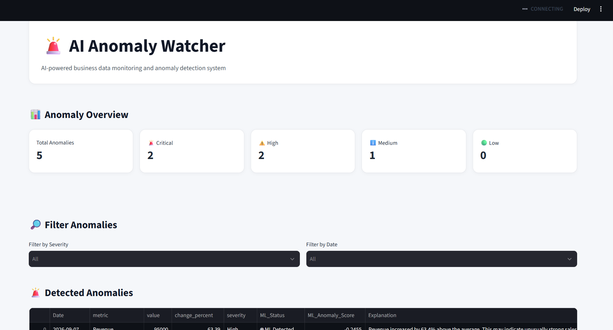
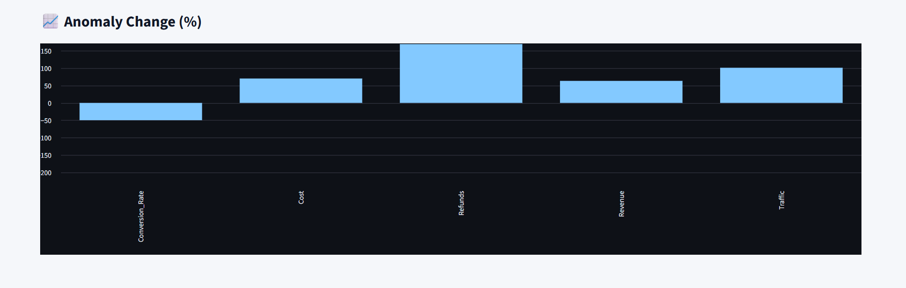

# 🚨 AI Anomaly Watcher

AI Anomaly Watcher is a business data monitoring and anomaly detection system that analyzes business performance data and identifies unusual changes in important business metrics.

The system monitors metrics such as Revenue, Orders, Conversion Rate, Traffic, Cost, and Refunds.

It combines statistical anomaly detection using **Z-score** with a machine learning approach using **Isolation Forest** to identify unusual business activity.

The system also generates business-friendly explanations, assigns alert severity, stores alert history, creates reports, and provides an interactive Streamlit dashboard.

---

## 🎯 Project Goal

The main goal of AI Anomaly Watcher is to help businesses identify unusual changes in their performance data quickly and understand what those changes may mean in a simple, business-friendly way.

Instead of manually checking large datasets, users can use the system to automatically detect unusual patterns, generate explanations, track alerts, and monitor business performance through an interactive dashboard.

---

## ✨ Features

- Business data monitoring
- CSV and Excel file support
- Data cleaning and validation
- Missing value and duplicate validation
- Statistical anomaly detection using Z-score
- Machine learning anomaly detection using Isolation Forest
- Automatic anomaly identification
- Percentage change calculation
- Business-friendly anomaly explanations
- Alert severity classification
- Alert history tracking
- Duplicate alert prevention
- Automated monitoring system
- Anomaly and alert reports
- Interactive Streamlit dashboard
- Severity-based filtering
- Date-based filtering
- Business impact summary
- Business insights
- Anomaly change visualization
- ML anomaly detection results
- Safe email alert test mode
- Environment variable based email configuration

---

## 🛠️ Technologies Used

- Python
- Pandas
- NumPy
- Scikit-learn
- Streamlit
- OpenPyXL
- Python-dotenv
- SMTP
- EmailMessage
- Statistical Z-score
- Isolation Forest
- Git
- GitHub

---

## 📁 Project Structure

```text
AI_Anomaly_Watcher/
│
├── screenshots/
│   └── dashboard.png
│
├── data/
│   ├── business_data.csv
│   └── business_data.xlsx
│
├── src/
│   ├── data_loader.py
│   ├── data_cleaner.py
│   ├── anomaly_detector.py
│   ├── explanation_generator.py
│   ├── alert_manager.py
│   ├── email_alert.py
│   ├── monitor.py
│   ├── ml_anomaly_detector.py
│   └── dashboard.py
│
├── .env
├── .gitignore
├── requirements.txt
└── README.md
```

Generated reports are created inside the `data` folder when the monitoring system runs.

---

## 🔄 How the System Works

The system follows these steps:

1. Business data is loaded from a CSV or Excel file.
2. The data is cleaned and validated.
3. Required columns and data types are checked.
4. Business metrics are analyzed statistically.
5. Average values and standard deviations are calculated.
6. Z-scores are calculated for each metric.
7. Unusual values are identified as statistical anomalies.
8. Percentage changes from the average are calculated.
9. An Isolation Forest machine learning model analyzes business records.
10. Business-friendly explanations are generated for detected anomalies.
11. Each anomaly is assigned a severity level.
12. Alerts are stored in alert history.
13. Anomaly and alert reports are generated.
14. The Streamlit dashboard displays detected anomalies and their details.
15. The monitoring module can run the complete anomaly detection process automatically.

---

## 📊 Business Metrics Monitored

The system monitors the following business metrics:

- Revenue
- Orders
- Conversion Rate
- Traffic
- Cost
- Refunds

---

## 📈 Statistical Anomaly Detection

The project uses a statistical **Z-score** approach to identify unusual business values.

A Z-score measures how far a value is from the average in terms of standard deviations.

A value is considered a statistical anomaly when:

```text
Absolute Z-score >= 2
```

For every detected anomaly, the system calculates:

- Average value
- Standard deviation
- Z-score
- Percentage change
- Severity
- Business explanation

---

## 🤖 Machine Learning Anomaly Detection

The project also uses the **Isolation Forest** algorithm from Scikit-learn.

Isolation Forest is an unsupervised machine learning algorithm that identifies unusual observations in a dataset.

The model analyzes multiple business metrics together:

```text
Revenue
Orders
Conversion_Rate
Traffic
Cost
Refunds
```

The system generates:

- ML anomaly prediction
- ML anomaly status
- ML anomaly score

The statistical Z-score approach works at the **metric level**, while the Isolation Forest model evaluates the **overall business record**.

---

## 🚨 Alert Severity

Detected anomalies are classified according to their percentage change from the average.

| Percentage Change | Severity |
|---|---|
| Less than 20% | Low |
| 20% to less than 50% | Medium |
| 50% to less than 100% | High |
| 100% or more | Critical |

This allows users to quickly understand the magnitude of detected changes.

---

## 💡 Business-Friendly Explanations

The system automatically generates simple explanations for detected anomalies.

For example:

```text
Revenue increased by 63.4% above the average.
This may indicate unusually strong sales activity.
```

For conversion rate:

```text
Conversion rate decreased by 49.7% below the average.
Traffic may not be converting into orders effectively.
```

These explanations make the anomaly results easier to understand for non-technical users.

---

## 📊 Dashboard

The project includes an interactive Streamlit dashboard for monitoring business anomalies.

The dashboard provides:

- Total anomaly count
- Critical alert count
- High alert count
- Medium alert count
- Low alert count
- Severity-based filtering
- Date-based filtering
- Detailed anomaly table
- Business impact summary
- Business insights
- Anomaly percentage chart
- ML anomaly detection results
- ML anomaly score
- Complete alert history

### Dashboard Preview



---

## 📄 Reports Generated

The monitoring system generates the following reports inside the `data` folder.

### `anomaly_report.csv`

Contains the complete dataset along with:

- Average values
- Standard deviations
- Z-scores
- Anomaly indicators
- Percentage changes
- ML anomaly information
- ML anomaly scores

### `alert_report.csv`

Contains detected anomalies and their alert information, including:

- Metric
- Value
- Percentage change
- Severity
- Explanation
- ML detection status
- ML anomaly score
- Date

### `alert_history.csv`

Stores historical alerts generated by the monitoring system and prevents duplicate historical entries for the same anomaly.

### `ml_anomaly_report.csv`

Contains machine learning anomaly detection results generated using Isolation Forest.

---

## 📥 Input Data

The system supports:

- CSV files
- Excel `.xlsx` files

The sample dataset contains the following columns:

```text
Date
Revenue
Orders
Conversion_Rate
Traffic
Cost
Refunds
```

Example:

```text
Date,Revenue,Orders,Conversion_Rate,Traffic,Cost,Refunds
2026-09-01,50000,500,4.5,10000,20000,20
2026-09-02,52000,510,4.6,10500,21000,22
2026-09-03,51000,505,4.4,10200,20500,21
2026-09-04,53000,515,4.5,10400,21000,20
2026-09-05,52000,508,4.6,10300,20500,22
2026-09-06,54000,520,4.5,10600,21500,23
2026-09-07,95000,520,2.1,25000,40000,80
```

The final row contains intentionally unusual business values for testing anomaly detection.

---

## 📧 Email Alert System

The project includes an email alert module using SMTP.

Email configuration is stored using environment variables in a `.env` file.

Example:

```text
EMAIL_SENDER=your_email@gmail.com
EMAIL_PASSWORD=NOT_SET
EMAIL_RECEIVER=your_email@gmail.com
```

When email credentials are not configured, the project uses a safe test mode.

In test mode, alert information is displayed in the terminal instead of sending an actual email.

> Never upload real email passwords, API keys, or other secrets to GitHub.

---

## ⚙️ Installation and Setup

### 1. Clone the Repository

```bash
git clone <your-github-repository-url>
cd AI_Anomaly_Watcher
```

### 2. Create a Virtual Environment

```bash
python -m venv venv
```

### 3. Activate the Virtual Environment

On Windows:

```powershell
venv\Scripts\activate
```

### 4. Install Dependencies

```powershell
pip install -r requirements.txt
```

### 5. Run Anomaly Monitoring

```powershell
python src/monitor.py
```

This runs the automated anomaly detection process.

### 6. Run the Dashboard

```powershell
streamlit run src/dashboard.py
```

The Streamlit dashboard will open in the browser.

---

## 🧪 Sample Detection Result

For the sample business dataset, the system detects unusual changes in several metrics.

Example output:

```text
Revenue: 95000 | Z-Score: 2.26 | Change: 63.39%

Conversion_Rate: 2.1 | Z-Score: -2.26 | Change: -49.66%

Traffic: 25000 | Z-Score: 2.27 | Change: 101.15%

Cost: 40000 | Z-Score: 2.26 | Change: 70.21%

Refunds: 80 | Z-Score: 2.26 | Change: 169.23%
```

The Isolation Forest model also identifies the corresponding business record as anomalous in the sample dataset.

---

## 🛡️ Error Handling

The system includes validation and error handling for:

- Missing files
- Empty datasets
- Unsupported file formats
- Missing required columns
- Invalid dates
- Invalid numeric values
- Duplicate records

Currently supported input formats:

```text
CSV
Excel (.xlsx)
```

---

## 🔐 Security

Sensitive information should never be stored directly in the source code.

The project uses:

- `.env` for local environment variables
- `.gitignore` to prevent sensitive files from being uploaded
- Safe email test mode when credentials are not configured

Before publishing the project to GitHub, verify that no passwords, API keys, tokens, or other secrets are present in the repository.

---

## 🚀 Future Improvements

Possible future improvements include:

- Real-time data monitoring
- Automated scheduled monitoring
- Larger real-world datasets
- Improved anomaly detection models
- Machine learning model tuning
- Real email notifications
- More advanced dashboard visualizations
- Database integration
- User authentication
- Cloud deployment
- Automated alert deduplication
- Additional business data sources
- Configurable input file selection
- More advanced business intelligence features

---

## 🎓 Learning Outcomes

Through this project, the following practical skills were developed:

- Python programming
- Data cleaning
- Data validation
- Exploratory data analysis
- Statistical anomaly detection
- Z-score analysis
- Machine learning
- Isolation Forest
- Business data interpretation
- Alert management
- Dashboard development
- Streamlit
- CSV and Excel data handling
- Environment variable management
- Git and GitHub
- Basic project documentation

---

## 👩‍💻 Author

**Shreya Singh**

BCA Student | Aspiring Data Analyst | Data Science & Machine Learning Enthusiast

I am a BCA student passionate about Data Analytics, Data Science, Machine Learning, and building practical technology solutions.

I enjoy working with Python, data analysis, visualization, and problem-solving. Through projects like **AI Anomaly Watcher**, I am developing practical skills by turning real-world business problems into data-driven solutions.

### Areas of Interest

- Data Analytics
- Data Science
- Machine Learning
- Python Programming
- Data Visualization
- Business Intelligence
- AI-based Solutions

### Career Goal

To build a career in the field of **Data Analytics and Data Science** by continuously learning new technologies and creating meaningful, data-driven projects.

### Connect

- GitHub: [github.com/shreyasingh67](https://github.com/shreyasingh67)
- LinkedIn: [linkedin.com/in/shreya-singh-85430433b](https://linkedin.com/in/shreya-singh-85430433b)